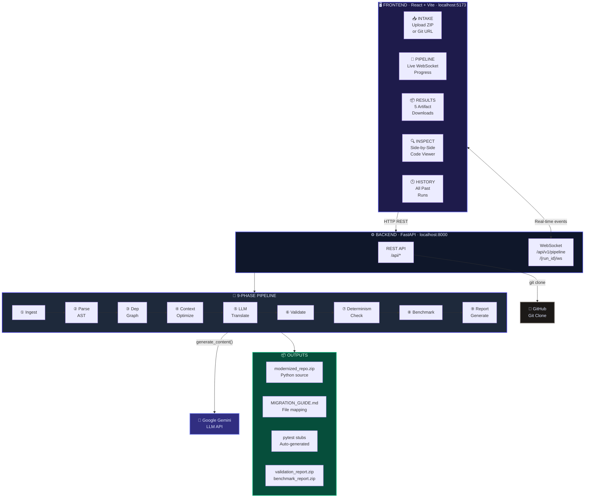
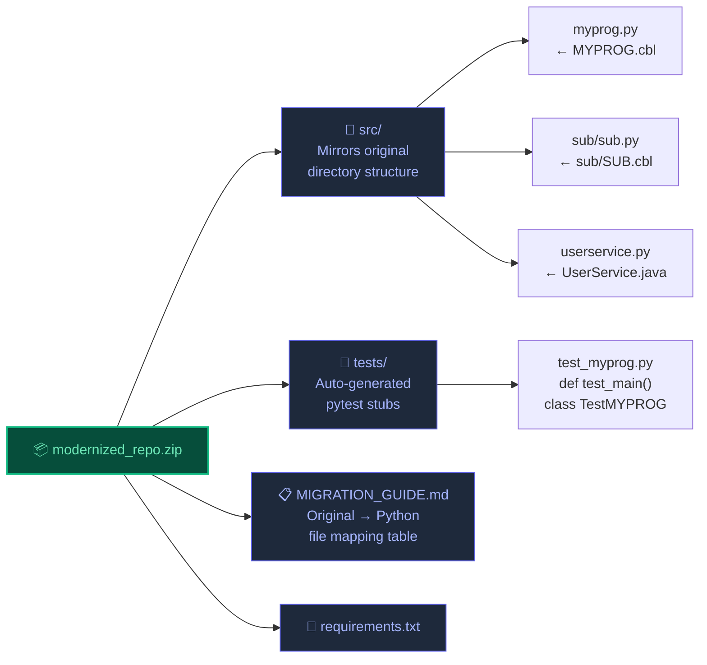

<div align="center">


<br/>


<br/><br/>

**AI-powered pipeline that translates legacy COBOL & Java repositories into clean, modern Python — with real-time progress, side-by-side inspection, and full artifact downloads.**

</div>

---

## 🔄 How It Works


---

## 🏗️ System Architecture



<br/>

### Layer Breakdown

| Layer | Technology | Responsibility |
|-------|-----------|----------------|
| **Frontend** | React 18 · Vite · Zustand · Framer Motion | UI, WebSocket client, state management |
| **REST API** | FastAPI · Pydantic v2 | Upload, start, status, download endpoints |
| **WebSocket** | FastAPI WebSocket | Real-time phase updates pushed to browser |
| **Pipeline** | Python asyncio · NetworkX | 9-phase orchestration, dependency graph |
| **Context Optimizer** | BFS · Token estimator | Prunes dependency context to fit token budget |
| **LLM Client** | google-genai SDK | Calls Gemini, tracks quota, handles errors |
| **Storage** | In-memory + JSON file | Run state, history persistence across restarts |

---

## 🔬 The 9-Phase Pipeline


---

## 📦 Output Structure



---

## 🚀 Quick Start

### 1 — Clone & Install

```bash
git clone https://github.com/bobatea02-tech/Legacy-Code-modernization.git
cd Legacy-Code-modernization

# Backend
cd backend && pip install -r requirements.txt

# Frontend
cd ../frontend && npm install
```

### 2 — Configure

```bash
# backend/.env
LLM_API_KEY=AIzaSy...                    # https://aistudio.google.com/apikey
LLM_MODEL_NAME=models/gemini-2.0-flash
MAX_TOKEN_LIMIT=8000
CONTEXT_EXPANSION_DEPTH=2
```

### 3 — Run

```bash
# Terminal 1
cd backend && python main.py        # → http://localhost:8000

# Terminal 2
cd frontend && npm run dev          # → http://localhost:5173
```

---

## 🖥️ Frontend Pages

| Page | What You Do |
|------|-------------|
| **INTAKE** | Upload a ZIP or paste a GitHub URL, hit START |
| **PIPELINE** | Watch all 9 phases update live via WebSocket |
| **RESULTS** | Download 5 artifact ZIPs when complete |
| **INSPECT** | Side-by-side original vs translated code, validation matrix |
| **HISTORY** | Every past run — re-download, re-inspect, delete |

---

## ⚙️ Configuration

| Variable | Default | Description |
|----------|---------|-------------|
| `LLM_API_KEY` | — | Gemini API key (required) |
| `LLM_MODEL_NAME` | `models/gemini-2.0-flash` | Model — 1,500 req/day free |
| `MAX_TOKEN_LIMIT` | `8000` | Token budget per file |
| `CONTEXT_EXPANSION_DEPTH` | `2` | BFS depth for dependency context |
| `CACHE_ENABLED` | `True` | Cache successful translations |

---

## 🛠️ Tech Stack

| | Backend | Frontend |
|---|---------|----------|
| **Framework** | FastAPI + Uvicorn | React 18 + Vite |
| **Language** | Python 3.11+ | TypeScript |
| **State** | In-memory + JSON persistence | Zustand |
| **LLM** | google-genai SDK (Gemini) | — |
| **Graph** | NetworkX | — |
| **Validation** | Pydantic v2 | — |
| **Animations** | — | Framer Motion |
| **Styling** | — | TailwindCSS |
| **Logging** | Loguru | — |

---

## 🔒 Security & Reliability

- **Zip Slip protection** — path traversal prevention on all extractions
- **Rate limit handling** — quota exhaustion detected, pipeline stops cleanly
- **No bad cache** — failed LLM responses are never cached
- **Auto cleanup** — temp files deleted after 24 hours
- **Persistent history** — run history survives backend restarts

---

<div align="center">

**Built with ❤️ — COBOL to Python, one file at a time.**


</div>
